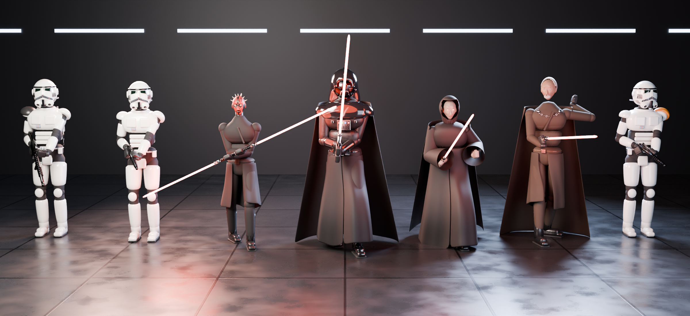
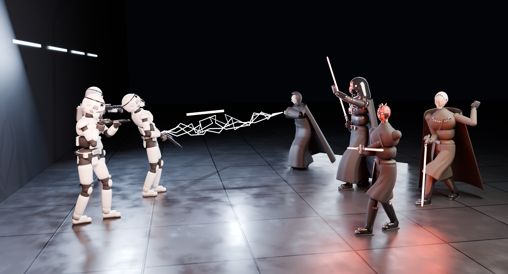
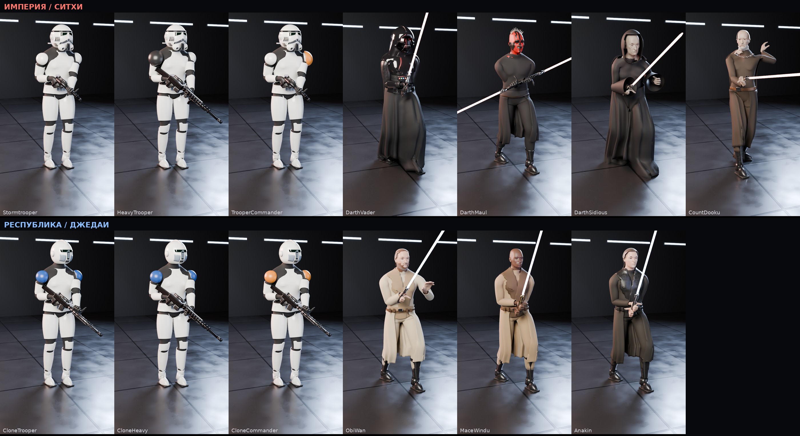
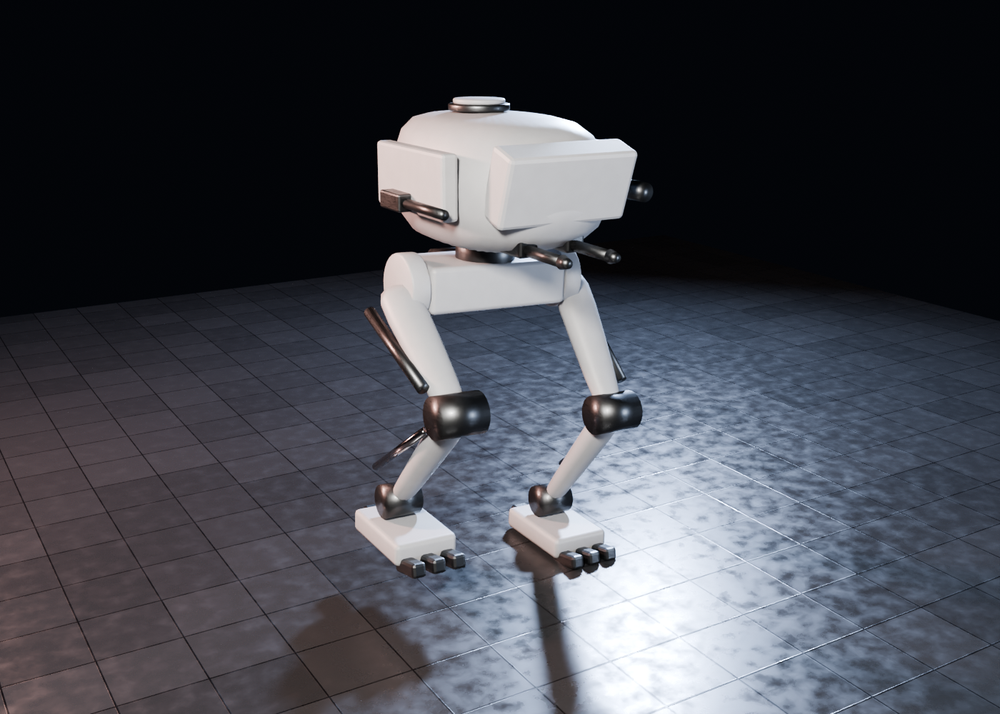
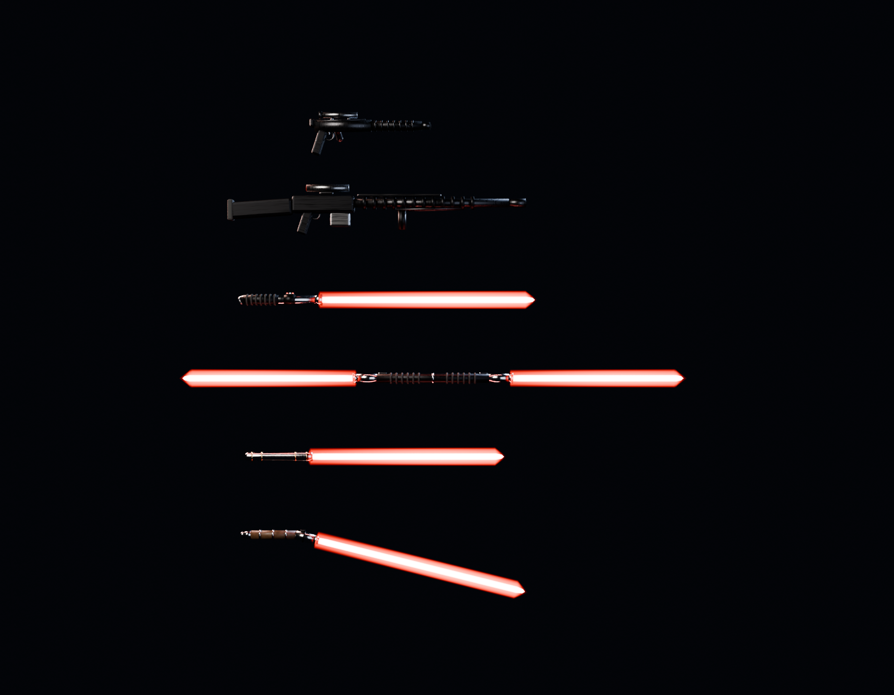
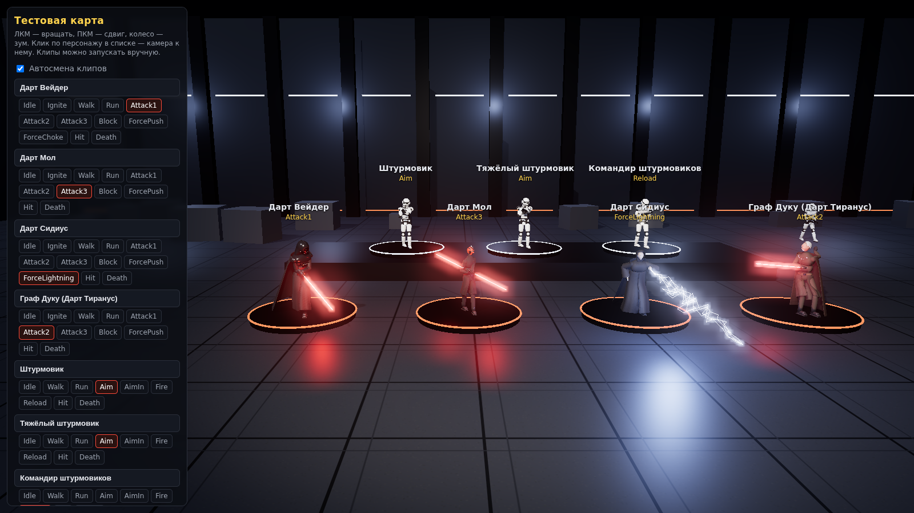

# GameUltra 2000 — фан-игра по мотивам «Звёздных войн»

Модели персонажей с оружием и анимациями плюс тестовый проект с тестовой картой, где всех персонажей
можно посмотреть в движении.

> Это некоммерческий фан-проект. «Звёздные войны», имена персонажей и их дизайн принадлежат Lucasfilm/Disney.
> Для личной игры и с друзьями — нормально; для продажи (Steam и т. п.) нужно будет заменить персонажей на своих.




## v2 — реалистичные модели и полигон «ситхи против джедаев»



**Персонажи v2** (`Assets/_Project/Art/CharactersV2/*.fbx`, 13 шт.) построены на реалистичном теле MakeHuman
(CC0): анатомия, лицо, настоящая текстура радужки, кожа с подповерхностным рассеянием. Броня — подогнанные по телу
пластины (не примитивы), ткань (юбки, плащи) — симуляция ткани Blender, обувь/перчатки/пояса — отдельные слои.

| Сторона | Персонажи | Оружие |
|---|---|---|
| Империя / ситхи | Штурмовик, Тяжёлый штурмовик, Командир, Дарт Вейдер, Дарт Мол, Дарт Сидиус, Граф Дуку | E-11, DLT-19, световые мечи |
| Республика / джедаи | Клон-солдат, Тяжёлый клон, Клон-командир, Оби-Ван, Мейс Винду, Энакин | DC-15A, DLT-19, синие/фиолетовый мечи |

Скелет — гуманоидный (Hips/Spine/Chest/UpperChest/Neck/Head, пальцы 3×5, Jaw, Eye) — подходит и под Unity Humanoid/Mixamo.

**Анимации v2**: стрелки — Idle, Walk, WalkAim, WalkBack, StrafeL/R, Run, Aim, AimIn, Crouch, CrouchAim, Fire,
FireAuto, Reload, Hit, HitBack, Ride, Drive; дуэлянты — Idle, Ignite, Walk/Run/Strafe, Attack1–4, Block, Deflect1/2,
ForcePush, ForceChoke (Вейдер), ForceLightning (Сидиус). **6 смертей**: Death_Back, Death_Forward, Death_Knees,
Death_Spin, Death_Headshot, Death_Blast — в последнем кадре тело переходит в **регдолл** (колени и локти — шарниры,
гнущиеся в одну сторону, шея — жёсткая пружина с узкими пределами, голова не крутится).

**Техника v2** (`Art/VehiclesV2`): Империя — AT-ST, спидер 74-Z; Республика — AT-RT, спидер BARC
(клипы Idle/Walk или Move/Fire/Death, сокеты Muzzle.*, Seat, Head).



### Полигон в Unity
1. Открыть проект в Unity 6 (6000.0.x, Built-in RP); дождаться импорта.
2. Меню **Star Wars → Собрать полигон (ситхи против джедаев)** — создаёт материалы, аниматоры, префабы
   (`Assets/_Project/PrefabsV2`) и сцену `Assets/_Project/Scenes/BattleArena.unity`. Нажать Play.
3. Слева — Империя, справа — Республика: кнопка спавнит отряд (размер 1/3/5/10), «x1» — одного; техника — по одной,
   с экипажем. «Авто-подкрепления» поддерживают бой. F1 — панель, P — пауза, T — замедление, Tab — следить за
   случайным бойцом, Esc — свободная камера (WASD + ПКМ).

ИИ: солдаты ищут цели по линии видимости, занимают укрытия, стреляют очередями с разбросом (растёт от движения и
подавления), перезаряжаются, отступают от джедаев/ситхов. Дуэлянты выбирают цели (дуэли в приоритете), кружат,
бьют комбо, блокируют, **отражают болты** обратно в стрелков, применяют Силу. Техника держит дистанцию, AT-ST бьёт
взрывными болтами, спидеры делают заходы. Попадания в голову — множитель урона и отдельная смерть.

Пересборка: `python Tools/Blender/build_v2.py -- [--only Имя] [--portrait --strips]`, техника — `--vehicles`,
рендер техники — `Tools/Blender/render_vehicles_v2.py`. Данные MakeHuman (CC0) — `Tools/Blender/makehuman/`.

> Unity в этой среде не запускался: C#-код проверен компиляцией против эталонных сборок Unity, но сцена собирается
> у вас при первом запуске меню. Если что-то не так — пришлите лог консоли.

---

## v1 (первая версия, примитивы)

## Что есть

### Персонажи (7)
| Модель | Рост | Оружие | Клипы |
|---|---|---|---|
| Штурмовик (`Stormtrooper`) | 1.83 | бластер E-11 | Idle, Walk, Run, Aim, AimIn, Fire, Reload, Hit, Death |
| Тяжёлый штурмовик (`HeavyTrooper`) — чёрный наплечник, ранец | 1.85 | тяжёлый бластер DLT-19 | те же |
| Командир штурмовиков (`TrooperCommander`) — оранжевый наплечник | 1.83 | E-11 | те же |
| Дарт Вейдер (`DarthVader`) — шлем, маска, пульт на груди, плащ | 2.02 | световой меч (хват двумя руками) | Idle, Ignite, Walk, Run, Attack1-3, Block, ForcePush, **ForceChoke**, Hit, Death |
| Дарт Мол (`DarthMaul`) — татуировки, рожки | 1.75 | двойной меч-посох | то же + Attack3 с вращением посоха |
| Дарт Сидиус (`DarthSidious`) — капюшон, роба | 1.73 | световой меч | то же + **ForceLightning** |
| Граф Дуку (`CountDooku`) — плащ с цепью, седая борода | 1.93 | меч с изогнутой рукоятью (фехтовальная стойка) | то же |

Все персонажи на **одном скелете**: Root, Hips, Spine, Chest, Neck, Head, Shoulder/UpperArm/LowerArm/Hand.L/R,
UpperLeg/LowerLeg/Foot/Toes.L/R + `Weapon.R` (оружие в правой руке), `Blade.R`/`Blade.R2` (клинки: масштаб по Y
— клинок зажжён/погашен, клип Ignite) и `Cape.1-3` (плащ). Анимации запечены по кадрам (30 к/с), на месте, без root motion.
Idle/Walk/Run/Aim зациклены. Walk — 1.6 м/с, Run — 4.5 м/с.

### Оружие (отдельные модели)
E-11, DLT-19, мечи Вейдера, Мола (двойной), Сидиуса, Дуку — `Assets/_Project/Art/Weapons/*.fbx`.



### Раскадровки анимаций
В `docs/renders/` лежит по картинке на каждый клип каждого персонажа (`<Имя>_<Клип>.png`, 6 кадров в ряд),
плюс портреты (`<Имя>.png`) и крупные планы лиц и шлемов (`<Имя>_face.png`).

## Файлы
```
Assets/_Project/Art/Characters/  <Имя>.fbx (Unity), <Имя>.glb (веб), characters.json — клипы и материалы
Assets/_Project/Art/Weapons/     оружие отдельно
Assets/_Project/Editor/          сборщик тестовой карты для Unity, настройки импорта
Assets/_Project/Scripts/         ShowcaseCharacter, Patrol, FlyCamera, TestMapUI
WebTestMap/                      та же тестовая карта в браузере (three.js, всё лежит локально)
Tools/Blender/                   скрипты, которые строят модели, анимации и рендеры
docs/renders/                    картинки
```

## Тестовый проект в Unity
1. Установите **Unity 6 (6000.0 LTS)**, в Unity Hub нажмите **Add → папка репозитория**.
2. При первом открытии проект сам импортирует модели и соберёт сцену `Assets/_Project/Scenes/TestMap.unity`.
   Если этого не произошло — меню **Star Wars → Собрать тестовую карту**.
3. Нажмите **Play**.

На карте: ангар, ситхи на постаментах впереди, штурмовики на платформе сзади, патрули штурмовиков вокруг,
стол с оружием. Каждый персонаж по очереди проигрывает все свои клипы. Мечи светятся и освещают всё вокруг,
бластер в клипе Fire стреляет болтом, Сидиус в ForceLightning бьёт молниями.

| Управление | |
|---|---|
| ПКМ + мышь | обзор |
| W A S D, Q / E | полёт, вниз / вверх; Shift — быстрее, колесо — скорость |
| Tab | следующий персонаж (камера подлетает к нему) |
| ← / → или 1–9 | клип выбранного персонажа |
| Пробел | вкл/выкл автосмену клипов |
| F1 | скрыть панель |

Проект на встроенном рендер-пайплайне (Built-in, шейдер Standard), материалы создаются по таблице
`characters_unity.json`. Ввод работает и со старым Input Manager, и с новым Input System.

## Тестовая карта в браузере


Тот же ангар и те же модели, без Unity:
- Windows: запустите `WebTestMap/start_server.bat` (нужен Python 3), откроется `http://localhost:8000/WebTestMap/`.
- Linux/macOS: `WebTestMap/start_server.sh`.

ЛКМ — вращать, ПКМ — сдвиг, колесо — зум. Слева список персонажей: клик по имени — камера к персонажу,
клик по клипу — проиграть его.

## Пересборка моделей (Blender)
Нужен Blender 4.2+ или модуль `bpy` (`pip install bpy==4.2.0` под Python 3.11).
```
python Tools/Blender/build_characters.py -- --weapons              # все модели + оружие
python Tools/Blender/build_characters.py -- --only DarthVader --preview --strips   # один персонаж + картинки
python Tools/Blender/render_showcase.py                             # общие рендеры
```
(с Blender: `blender --background --python Tools/Blender/build_characters.py -- ...`)

Как это устроено: модели собираются из примитивов (`swlib/troopers.py`, `swlib/sith.py`, `swlib/weapons.py`).
Анимации задаются ключевыми позами в пространстве персонажа (`swlib/anims.py`): положение оружия, стоп и корпуса.
IK решает руки и ноги (`swlib/rig.py`), затем всё запекается в обычный FK-скелет.
